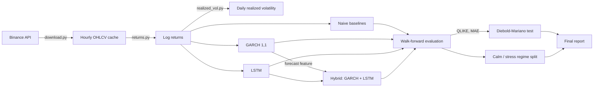

# Crypto Volatility Forecasting

Forecasts next-24h volatility for Bitcoin and Ethereum -- **not price direction**.
Price is essentially unpredictable; volatility (how violently price moves) is
partially predictable, thanks to volatility clustering. This repo pits a
classical statistical model (GARCH) against deep learning (LSTM) and a
hybrid of the two, under strict walk-forward validation, and checks whether
any improvement over the classical baseline is statistically significant.

> Personal project. Public market data. Not investment advice.

[](LICENSE)

## Table of contents

- [Why volatility, not price](#why-volatility-not-price)
- [Pipeline](#pipeline)
- [Results](#results)
- [Installation -- users](#installation--users)
- [Installation -- developers](#installation--developers)
- [Contributor expectations](#contributor-expectations)
- [Known issues](#known-issues)

## Why volatility, not price

Nobody can reliably predict whether Bitcoin's price will go up or down
tomorrow -- if they could, they wouldn't be selling that prediction as a blog
post. But *how violently* the price moves is a different question, and it
has real structure: turbulent days cluster together, and calm days cluster
together. That's volatility clustering, and it's the entire premise this
repo is built on.

This matters because volatility is what risk management is actually built
on -- position sizing, stop-loss placement, and options pricing all depend
on an estimate of expected volatility, not a guess about direction.

The choice of *log returns* over raw prices is not a textbook default here --
it's measured on this project's own data. An Augmented Dickey-Fuller test on
BTC's price series gives p=0.396 (cannot reject non-stationarity), while the
same test on log returns gives p<0.0001 (clearly stationary). Every model in
this repo works on log returns because of that measured result, not because
a textbook said so. Full ADF results: [`results/adf_report.json`](results/adf_report.json).

## Pipeline



Every model is scored through the same rolling-origin walk-forward protocol:
fit on a 12-month trailing window, forecast the next day, slide forward one
day, repeat across the full test year. No model ever sees a day's data
before every prior day has been "lived through" -- verified by a test that
plants a poisoned future value and asserts no training window can see it
([`tests/test_walk_forward.py`](tests/test_walk_forward.py)).

## Results

Five-way comparison. QLIKE is the project's primary metric (lower is
better) -- it punishes under-prediction of risk far more severely than
over-prediction, which is what a risk system actually needs. MAPE (also
lower is better) is a plain percentage-error figure included for
intuition, but it's *not* the primary metric: MAPE treats over- and
under-prediction symmetrically, so it can and does disagree with QLIKE (see
note below the table).

| Model | BTC QLIKE | BTC MAE | BTC MAPE | ETH QLIKE | ETH MAE | ETH MAPE |
|---|---|---|---|---|---|---|
| Persistence | 0.909 | 0.00833 | 52.3% | 0.901 | 0.01152 | 49.9% |
| Rolling mean (7d) | 0.492 | 0.00718 | 45.1% | 0.572 | 0.00993 | 43.8% |
| **GARCH(1,1)** | **0.406** | 0.00766 | 52.9% | **0.458** | 0.01243 | 69.2% |
| LSTM | 0.572 | 0.00763 | 50.8% | 0.489 | 0.01059 | 52.1% |
| Hybrid (GARCH + LSTM) | 0.512 | 0.01078 | 64.5% | 0.488 | 0.01070 | 53.2% |

**GARCH(1,1) is the best model on both coins by QLIKE.** But the honest
caveat, from running a Diebold-Mariano test on every pairwise comparison
(not just one): GARCH's edge over a plain 7-day rolling mean is **not**
statistically significant on either coin (p=0.139 BTC, p=0.340 ETH). On BTC
its edge over the LSTM (p=0.018) and hybrid (p=0.049) is significant, and
the hybrid significantly beats the plain LSTM there (p=0.026); on ETH none
of the pairwise differences are significant at all. Full DM table in
[`results/analysis.md`](results/analysis.md), reported plainly either way,
per this project's rule against massaging results.

Notice GARCH's MAPE is high despite its best QLIKE -- worst of all models on
ETH (69.2%) and mid-pack on BTC (52.9%, where the hybrid's 64.5% is actually
worse). That's not a contradiction, it's exactly what QLIKE rewards that
MAPE doesn't: GARCH's errors skew toward over-predicting risk, which QLIKE
treats as a much smaller sin than under-predicting it. A model optimized for
MAPE alone would not necessarily be the model you want for risk management.

The result that matters most for a risk instrument: **GARCH has the lowest
absolute stress-day QLIKE of any model on both coins** (BTC 1.29, ETH 0.87).
On BTC that's well under half the LSTM's (3.05). The LSTM and hybrid looked
reasonably competitive on calm-day averages but both broke down specifically
on the top-decile most volatile days -- the days a risk model exists to get
right -- and this gap did not close even after fixing the LSTM/hybrid refit
cadence (see below). (Note: GARCH is best on absolute stress-day *loss*, not
on the calm-to-stress *degradation ratio* -- persistence has a smaller ratio
only because it starts from a much worse calm-day baseline. See
[`results/analysis.md`](results/analysis.md) for that distinction.)

**Refit cadence was tested and fixed.** The LSTM and hybrid originally
refit monthly against GARCH's weekly refit, as a CPU-budget tradeoff.
Switching them to weekly refit (matching GARCH) was tested directly and
produced a real, reproducible improvement on every combination -- 2.9% to
4.6% lower QLIKE -- and is now the permanent configuration. It narrowed the
gap to GARCH but did not close it. Full before/after numbers in
[`results/analysis.md`](results/analysis.md).

Full analysis, every number sourced from committed `results/` files:
[`results/analysis.md`](results/analysis.md) · GARCH parameter interpretation:
[`results/garch_interpretation.md`](results/garch_interpretation.md) · LSTM
and hybrid honest write-ups:
[`results/lstm_interpretation.md`](results/lstm_interpretation.md),
[`results/hybrid_interpretation.md`](results/hybrid_interpretation.md).

Plots (regenerated by `python -m src.eval.report`):

- `results/plot_forecast_vs_realized_{SYMBOL}.png` -- forecast vs. realized
  volatility over the test year, with a zoomed panel on the most violent week
- `results/plot_cumulative_qlike_{SYMBOL}.png` -- cumulative QLIKE
  difference, best contender vs. GARCH
- `results/plot_calm_vs_stress_{SYMBOL}.png` -- calm vs. stress QLIKE by model

### Demo video

*(Link to be added -- recorded by the repo owner. See the CLI demo below for
the same command shown in the video.)*

## Installation -- users

Reproduces every reported number offline, no API access required:

```bash
docker build -t crypto-vol-forecast .
docker run crypto-vol-forecast
```

This runs `src/eval/run_final_report.py`, which re-scores every model's
committed walk-forward forecast (the `results/*_forecast_*.csv` files) and
recomputes the full five-way table, the Diebold-Mariano tests, and the
calm/stress breakdown. It does **not** retrain the models from scratch --
retraining the LSTM and hybrid takes many minutes on CPU. To regenerate the
forecasts themselves from the cached price data, run the individual
`src/eval/run_*.py` stages listed under the developer instructions below.

To run the forecast CLI directly instead:

```bash
docker run crypto-vol-forecast python -m src.cli forecast --pair BTC --horizon 24h
```

The CLI is a convenience demo: it fits GARCH on the entire cached history
(not the rolling 12-month walk-forward window the evaluation uses), so its
single printed number is illustrative, not one of the evaluated QLIKE
figures. It also forecasts the first day *after* the cached data ends, and
prints that date explicitly -- the cache is a fixed snapshot, so "next day"
is relative to the snapshot, not the calendar.

## Installation -- developers

```bash
python -m venv .venv
source .venv/bin/activate  # .venv\Scripts\activate on Windows
pip install -r requirements.txt

# Run the test suite and lint
pytest -v
ruff check src tests

# Re-download the raw data (optional -- the cache is already committed)
python -m src.data.pipeline

# Re-run any stage of the pipeline
python -m src.eval.run_baselines
python -m src.eval.run_garch
python -m src.eval.run_lstm      # several minutes on CPU
python -m src.eval.run_hybrid    # several minutes on CPU
python -m src.eval.run_final_report
python -m src.eval.report        # regenerate plots
```

The forecast CLI:

```bash
python -m src.cli forecast --pair BTC --horizon 24h
```

## Contributor expectations

- Branch per change, PR into `main` -- no direct pushes to `main`.
- `pytest -v` and `ruff check src tests` must both pass before a PR is opened.
- CI runs the full test suite, lint, and a QLIKE regression gate
  (`src/eval/ci_regression_gate.py`) that re-fits GARCH on the committed
  cache and fails the build if QLIKE regresses by more than 5% -- a fast
  check that doesn't require retraining the LSTM/hybrid on every push.

## Known issues

- **Refit cadence: fixed, not just documented.** The LSTM and hybrid
  originally refit monthly against GARCH's weekly refit, as a CPU-budget
  tradeoff. This was tested directly and found to cost real accuracy (2.9%
  to 4.6% higher QLIKE across all four LSTM/hybrid x BTC/ETH combinations),
  so both models now refit weekly, matching GARCH. Daily refit for the
  neural models remains impractical on CPU and was not attempted at scale.
  The stress-regime gap to GARCH did *not* close with this fix, suggesting
  it's a structural difference between the models rather than purely a
  training-frequency artifact -- see `results/analysis.md`.
- **~2 years of data is a small-data regime for a neural network.** The
  LSTM and hybrid models learned real structure (they beat plain persistence
  on both coins, and the rolling mean on ETH -- though not on BTC, where the
  rolling mean beats them) but did not have enough independent training
  signal to match a well-specified 3-parameter GARCH model on this dataset
  size, even after the refit-cadence fix above.
- **The hybrid is scored on fewer days than the other models.** GARCH's
  forecast feature only exists for the test period, so the hybrid gets 345
  scored days (vs. 364-365) and its early training window is effectively
  expanding rather than the fixed rolling 12-month window used elsewhere.
  Re-scoring on the shared 345 days doesn't change the ranking, but the
  hybrid's numbers aren't strictly apples-to-apples -- see `results/analysis.md`.
- **GARCH's edge over a plain moving average is not statistically
  significant.** By the Diebold-Mariano test, GARCH's lower QLIKE vs. a 7-day
  rolling mean cannot be distinguished from noise on either coin (p=0.139
  BTC, p=0.340 ETH). GARCH is the best model by point estimate, but this
  sample doesn't prove it beats the trivial baseline.
- **Data gaps**: the download pipeline detects and reports gaps explicitly
  (`results/integrity_report.json`) rather than silently interpolating over
  them; the committed cache for this run had zero gaps and zero duplicate
  timestamps on both symbols.
- **Stress-period weakness is real and reported, not hidden**: every model
  in this repo, including GARCH, gets meaningfully worse on the most
  volatile 10% of days. GARCH has the lowest *absolute* stress-day loss on
  both coins, but that's not the same as "handles stress days well in
  absolute terms" -- see `results/analysis.md` for the actual numbers.
- **Not investment advice.** This forecasts volatility, not price direction,
  and is built on public market data for a portfolio project, not a
  production risk system.
